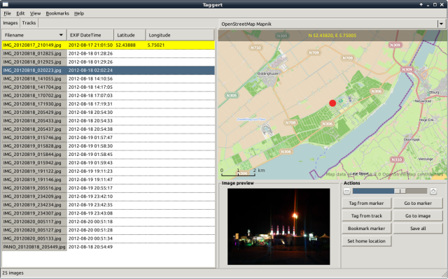

Taggert
=======

Taggert is a GTK+ geotagging application, written in Python. It uses PyGObject
and as such needs GTK+ >= 3.0. Taggert is not compatible with GTK+ 2.x.

Usage
-----

The idea behind Taggert is fairly simple:
* Select a directory containing image files that you want to geo-tag
* For tagging manually: select a location on the map by setting a marker
* For bulk-tagging: Load GPS tracks from one or more GPX files
* Select one ore more images in the list
* Click a button to add the marker's location or a matching location from the
  GPS track to the selected images
* Save your changes

Features
--------

* Geo-tagging manually and with the help of GPS tracks from GPX files
* When tagging from GPX tracks, elevation (altitude) is also handled
* Offers different free maps to work on, like different Openstreetmap maps,
  MapQuest maps and satellite images and maps-for-free
* Shows a preview of selected images, so you know what you're doing
* Lets you create bookmarks for locations, so you can easily go back to the
	locations that you frequently visit
* Lets you remove tags from images, too
* Uses GSettings to store runtime configuration options
* Uses pytz to (hopefully) reliably calculate timezone offsets for tracks
* Configurable colors for drawing tracks and markers
* Lets you tag any file format supported by exiv2

Prerequisites
-------------

The following software is needed to run Taggert:

* Python (developed and currently only tested with v2.7)
* PyGObject    (Debian: python-gi)
* pytz         (Debian: python-tz) for timezone calculations

and the following PyGObject introspection libraries:

* Gtk and Gdk  (Debian: gir1.2-gtk-3.0:)
* GtkChamplain (Debian: gir1.2-gtkchamplain-0.12)
* Champlain    (Debian: gir1.2-champlain-0.12)
* Clutter      (Debian: gir1.2-clutter-1.0)
* GtkClutter   (Debian: gir1.2-gtkclutter-1.0)
* GLib / Gio   (Debian: gir1.2-glib-2.0)
* GdkPixbuf    (Debian: gir1.2-gdkpixbuf-2.0)
* GExiv2       (Debian: gir1.2-gexiv2-0.4)

and of course all of the dependencies of these packages, like libexiv2,
libclutter, libchamplain, etc.

Taggert is developed and tested on Python 2.7. Compatibility with Python 2.6
or Python 3 is untested. However, since this application was changed to use
[GExiv2](https://wiki.gnome.org/Projects/gexiv2) instead of pyexiv2, Python 3
support should no longer be a problem and is therefore on the roadmap.

Installation
------------

Taggert is not packaged in any form yet, you have to checkout the source code
from Github and you can run it straight from the checked out directory. The
only thing that needs to be installed is the GSettings Schema.

On Debian, copy 'com.tinuzz.taggert.gschema.xml' to /usr/share/glib-2.0/schemas/
and (as root) run 'glib-compile-schemas /usr/share/glib-2.0/schemas'. That
program is part of the 'libglib2.0-bin' package.

When all prerequisites are installed, you should be able to run Taggert:

    ./taggert_run

Packaging for Debian or Ubuntu
------------------------------

Taggert comes with a 'debian' directory that contains the necessary information
for creating Debian and/or Ubuntu packages. If you have a working pbuilder
setup, running 'pdebuild' inside the root of your clone should get you a
working package.

Credits
-------

Taggert is written and maintained by Martijn Grendelman <m@rtijn.net>. It was
inspired heavily by [GottenGeography](https://github.com/robru/gottengeography),
written by Robert Bruce Park, and his code was used as a starting point on some
occasions.

Earlier versions of Taggert used GPX parsing code from
[GPX Viewer](http://andrewgee.org/blog/projects/gpxviewer/), which
was written by Andrew Gee and used with permission. For version 1.3, GPX
parsing, validating and storage is now all done with lxml.etree and Andrew
Gee's code is no longer used.

The bundled code for parsing ISO8601 date strings comes from [the 'pyiso8601'
module, hosted on Bitbucket](https://bitbucket.org/micktwomey/pyiso8601)
and is copyright (C) 2007-2013 Michael Twomey.

Taggert's application icon was created by Martijn Grendelman, by combining parts
from two different icons from
[OSA Icon Library 11.02](http://www.opensecurityarchitecture.org/cms/library/icon-library).

The first incarnation of Taggert was based on
[osm-gps-map](http://nzjrs.github.com/osm-gps-map/) rather than
libchamplain and its code was based on the bundled
[mapviewer example](x<https://github.com/nzjrs/osm-gps-map/blob/master/examples/mapviewer.py),
written by Hadley Rich. I don't think that any code written by Hadley Rich
is present in the current version of Taggert.

Taggert is licensed under the Apache License, version 2.0. A copy of the
license can be found in the 'COPYING' file and
[on the web](http://www.apache.org/licenses/LICENSE-2.0).

Roadmap
-------

* Support for more GPS file formats. Only GPX is supported now.
* Analyzing, editing and exporting GPS tracks
* More extensive bookmark management, for example import from and export to GPX waypoints
* Tools to correct DateTime tags on images, to fix deviations in your camera's clock.
* Python 3 support

Robert Bruce Park, who created GottenGeography, also created [GObject
Introspection data for 'gexiv2'](https://wiki.gnome.org/Projects/gexiv2),
making this GObject wrapper usable from Python, including version 3. His work
has been merged with upstream gexiv2 and appeared in gexiv2 version 0.5.0.
Taggert has been rewritten to use gexiv2, which will also allow for Python 3
support.

History
-------
2012-11-05   Released version 1.2
2012-10-24   Released version 1.1
2012-10-15   Released version 1.0

See 'CHANGES' for a summary of changes for each version.
